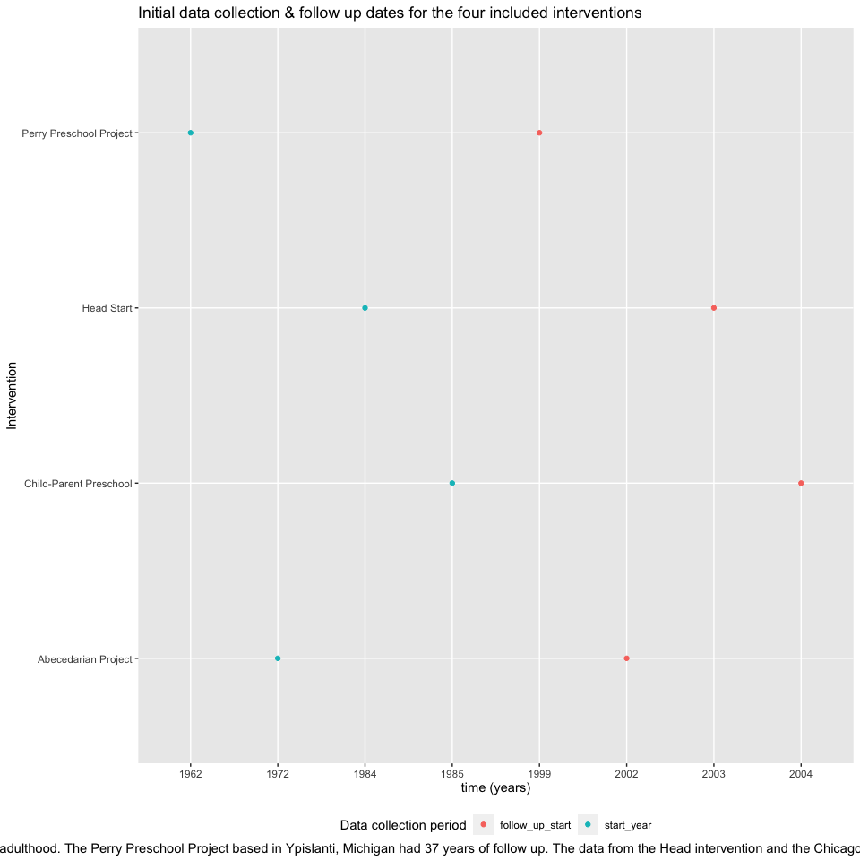

Systematic Review
================

``` r
library(tidyverse)
```

    ## ── Attaching packages ─────────────────────────────────────── tidyverse 1.3.1 ──

    ## ✓ ggplot2 3.3.5     ✓ purrr   0.3.4
    ## ✓ tibble  3.1.4     ✓ dplyr   1.0.7
    ## ✓ tidyr   1.1.3     ✓ stringr 1.4.0
    ## ✓ readr   2.0.1     ✓ forcats 0.5.1

    ## ── Conflicts ────────────────────────────────────────── tidyverse_conflicts() ──
    ## x dplyr::filter() masks stats::filter()
    ## x dplyr::lag()    masks stats::lag()

``` r
library(viridis)
```

    ## Loading required package: viridisLite

``` r
library(ggridges)


knitr::opts_chunk$set(
  echo = TRUE,
  warning = FALSE, 
  fig.width = 10, 
  fig.asp = 1,
  out.width = "100%"
)
theme_set(theme(legend.position = "bottom"))
```

``` r
sys_review = tibble( 
intervention = c("Child-Parent Preschool", "Perry Preschool Project", "Head Start", "Abecedarian Project" ),
start_year = factor(c("1985", "1962", "1984", "1972")),
follow_up_start = factor(c("2004", "1999", "2003", "2002"))
)
```

Plotting

``` r
sys_review %>% 
  pivot_longer(
    start_year:follow_up_start,
    names_to = "collection",
    values_to = "year"
  ) %>% 
  group_by(collection) %>% 
  ggplot(aes(x = year, y = intervention, color = collection)) +
    geom_point() +
  labs(
    title = "Initial data collection & follow up dates for the four included interventions",
    x = "time (years)",
    y = "Intervention",
    color = "Data collection period",
    caption = "Based on the inclusion criteria for this systematic review, each selected intervention had at least 19 years of follow up to ensure participants were surveyed into adulthood. The Perry Preschool Project based in Ypislanti, Michigan had 37 years of follow up. The data from the Head intervention and the Chicago Child-Parent Center Preschool intervention was collected over more than 19 years. The Chapel Hill, NC based Abecedarian Project collected data from participants for over 30 years."
  ) +
  theme(plot.caption = element_text(lineheight = 3))
```


